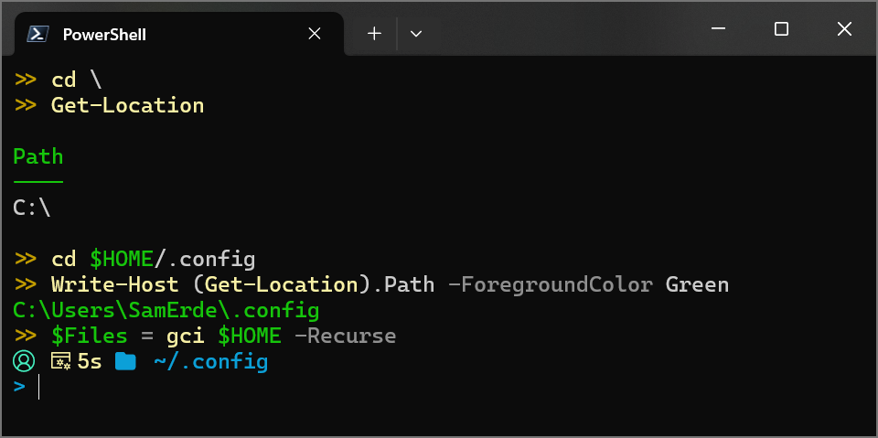
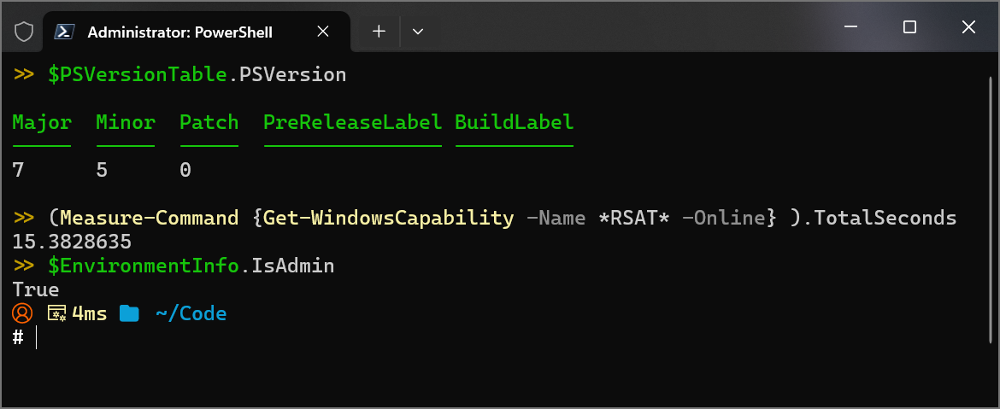

# Comply Theme for Oh My Posh

Comply is a simple Oh My Posh theme for users who only want essential information in their prompt.

## Features

- A user glyph (👤) that changes color from cyan to orange when running as root/admin.

- A segment that shows the execution time of the last command. It automatically formats the time as milliseconds, seconds, minutes, or hours (etc) when relevant.

- The current path displayed after a folder glyph (📁). When in your home folder's path, the standard ~ character takes its place to reduce length and provide some privacy when sharing screenshots (eg: "C:\Users\JaneDoe\Downloads" becomes "~\Downloads").

- The prompt character appears by itself on a new line, which makes the command history easier to read.
- The prompt character changes from a white `>` to an orange `#` when running as admin/root, which should familiar to users who run `sudo` or `enable`.

- A transient prompt: the full prompt is rendered only for the current command. All previously executed command lines have a simplified `>>` prompt in yellow to reduce clutter and improve readability.

## Screen Shots

### Comply theme running as a standard user

### Comply theme running as an elevated admin/root user

## Getting Started

To use the Comply theme, download '[comply.omp.json](comply.omp.json)' and add it to your PowerShell profile.

For more information, visit [ohmyposh.dev](https://ohmyposh.dev).
